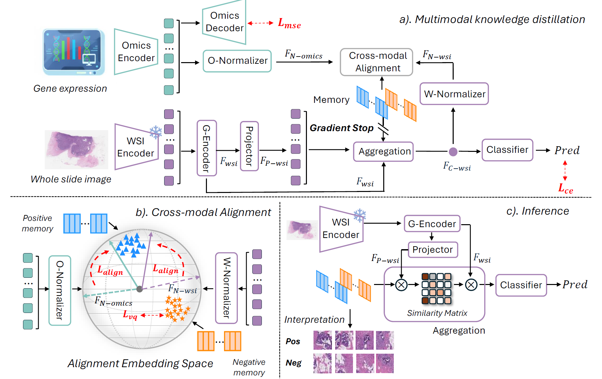

# Momentum Memory for Knowledge Distillation in Computational Pathology (MoMKD)

[](https://arxiv.org/abs/2602.21395)
[](https://doi.org/10.48550/arXiv.2602.21395)


Official implementation of the CVPR 2026 paper:

> **Momentum Memory for Knowledge Distillation in Computational Pathology**  
> Yongxin Guo et al.  
> *IEEE/CVF Conference on Computer Vision and Pattern Recognition (CVPR), 2026*

---

## 🧠 Overview

Multimodal learning has demonstrated remarkable progress in cancer diagnosis. However, its clinical deployment is constrained by the limited availability of paired histology–omics data. Knowledge Distillation (KD) offers a practical solution by transferring molecular supervision into histopathology-only models.

Existing KD approaches rely on **batch-local alignment**, which entangles modality-specific variations and results in brittle generalization.

We propose:

## 🚀 Momentum Memory for Knowledge Distillation (MoMKD)

MoMKD introduces a **momentum-updated memory module** with a **gradient-decoupled strategy** to:

- Accumulate cross-batch morpho–molecular statistics  
- Enlarge effective alignment scope beyond mini-batches  
- Suppress batch-local noise  
- Improve out-of-domain generalization  

Extensive experiments on:

- **TCGA-BRCA** (HER2, PR, ODX classification)
- An in-house dataset  

demonstrate superior robustness compared to state-of-the-art MIL and multimodal KD baselines.

---

## 🏗 Architecture

<p align="center">
  
</p>

---

# ⚙️ Installation

Tested with:

- Python 3.11  
- CUDA 12.8  

Create environment:

```bash
conda env create -f environment.yml
conda activate MoMKD
```


# 📂 Dataset Preparation

## 1️⃣ Download Dataset

Download **[TCGA-BRCA](https://portal.gdc.cancer.gov/projects/TCGA-BRCA)** 
WSI and paired omics data from the official GDC Data Portal.


---

## 2️⃣ WSI Feature Extraction

We use the **TRIDENT pipeline** with the **UNI V2 backbone**.

- Patch size: 896  
- Smaller patches may improve performance but increase training time  

After feature extraction, construct KNN graph:

```bash
python graph.py
```

---

## 3️⃣ Omics Preprocessing

Navigate to:

```
gene_selection/
```

Ensure:

- Omics expression file is placed in `/data`
- Label file (ready as BRCA.csv) exists

Run:

```bash
bash gene_select.sh
```

Default gene selection:

- Top 768 genes  
- Moderate variation (512–1024) is acceptable  
- Avoid extreme values (e.g. 1)  

---

## 4️⃣ Format Conversion

Required formats:

- WSI features → `.h5`
- Omics data → `.npy`

⚠️ Recommended: store absolute paths in the main CSV file.

---

# 🏋️ Training

We provide a training script:

```
run.sh
```

Modify the following variables:

```bash
MAIN_CSV_PATH="..."
LABEL_COLUMN="..."
POSITIVE_LABEL_VALUE="..."
```

Run training:

```bash
bash run.sh
```


# 💡 Future Improvements

Recent findings in vector quantization suggest:

- Smaller memory dimensions  
- Compact memory representations  

may further improve generalization.

We encourage experimentation with:

- Memory size  
- Momentum coefficient  
- Decoupling strength  

---

# 📁 Project Structure

```
MoMKD/
│
├── gene_selection/
├── models/
├── graph.py
├── run.sh
├── environment.yml
└── README.md
```

---

# 📜 License

This project is released for **non-commercial academic research use only**.

---

# 📌 Citation

If you find this work useful, please cite:

```bibtex
@article{guo2026momkd,
  title={Momentum Memory for Knowledge Distillation in Computational Pathology},
  author={Guo, Yongxin and Lu, Hao and Koyun, Onur C. and Zhu, Zhengjie and Demir, Muhammet Fatih and Gurcan, Metin Nafi},
  journal={arXiv preprint arXiv:2602.21395},
  year={2026}
}
```


# 📬 Contact

Yongxin Guo  
yongxin.guo@wfusm.edu

---

# ⭐ Acknowledgements

We thank the authors of:

- TRIDENT  

for their open-source contributions.
